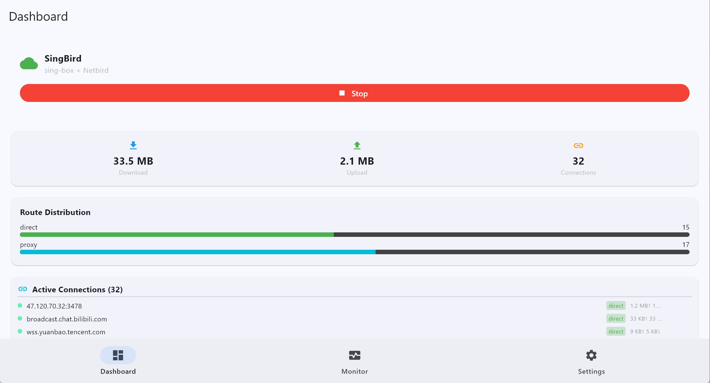
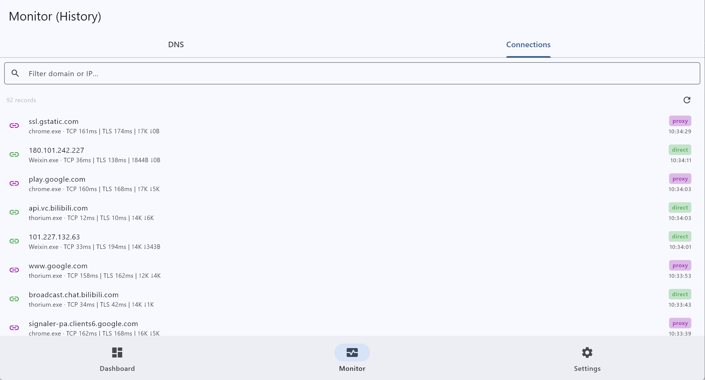
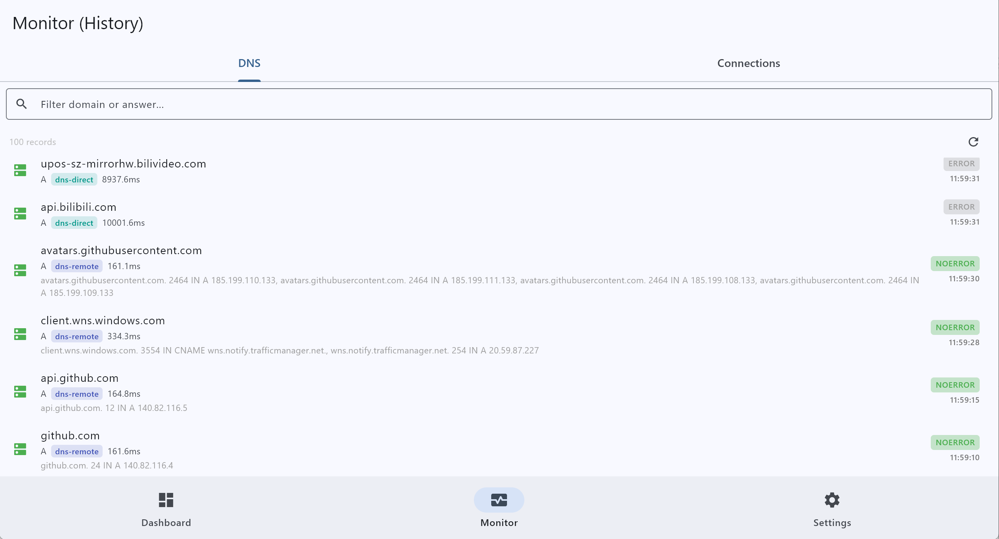
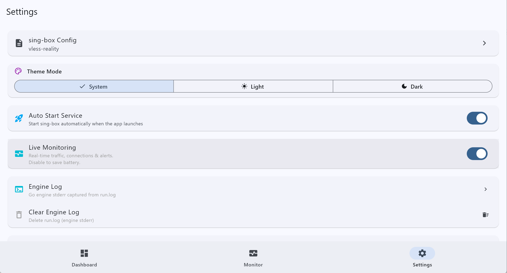
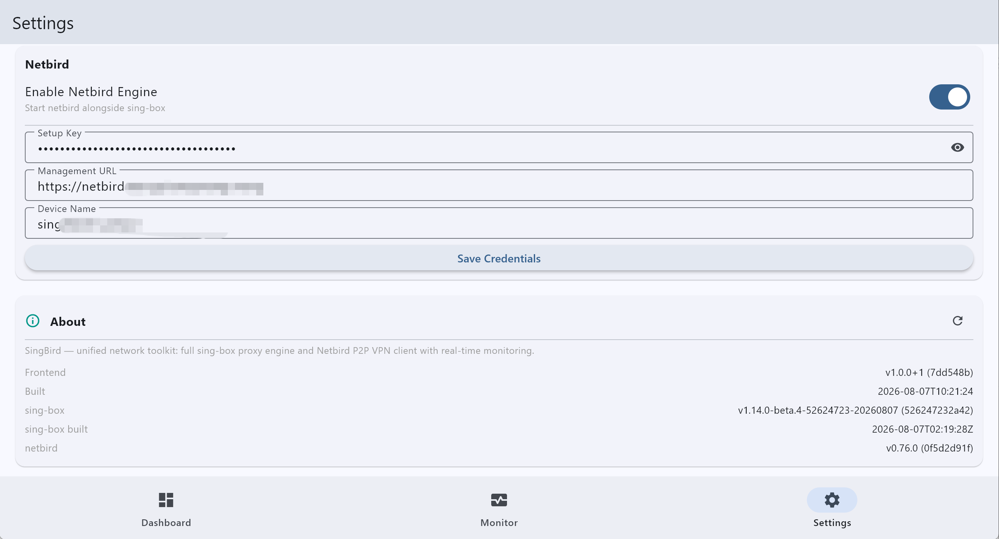

# SingBird

一个基于 Flutter 的跨平台网络工具箱，将 **sing-box 代理引擎**与 **Netbird P2P VPN 客户端**合并为单一应用，内置实时网络监控、流量统计与配置管理。

- **跨平台**: Windows（主平台）+ Android
- **完整 sing-box 引擎**: Windows 以子进程方式拉起 `sing-box.exe`，Android 使用 gomobile 构建的 `libbox.aar`（进程内）——完整代理功能，不只是监控
- **Netbird P2P VPN**: 内置 Netbird 客户端（WireGuard 网状 VPN），可与 sing-box 同时运行或单独运行
- **实时仪表盘**: 活跃连接、上行/下行流量、路由分布
- **DNS 监控**: 查询记录、延迟、传输方式（数据来自 sing-box 的 SQLite 后端）
- **连接生命周期追踪**: TCP/TLS 延迟注入，open → update → close 事件
- **配置档案**: sing-box / netbird 配置的创建、编辑与切换
- **持久化历史**: DNS 查询、连接记录、告警事件（SQLite）
- **告警系统**: 基于规则延迟阈值的应用内通知
- **系统托盘**（Windows）: 最小化到托盘后台运行

---

## 应用截图











## 项目架构

### 三个仓库，平级存放

SingBird 不是一个单一代码库，而是 **1 个 Flutter 前端 + 2 个 Go 后端仓库** 的组合。三个仓库约定平级放在同一父目录下：

```
<works>/
├── singbird/      # 本仓库 — Flutter 客户端（你在这里）
├── sing-box/              # Go 后端 — 代理引擎 + 监控钩子 + netbird 集成
└── netbird/               # Go 后端 — P2P VPN 引擎（只读，不修改）
```

| 仓库 | 分支 | 角色 |
|------|------|------|
| `singbird`（本仓库） | `sing-netbird` | Flutter UI + 平台适配，不含 Go 代码 |
| `sing-box` | `my_custom` | 统一 Go 二进制：sing-box + monitor hooks + netbird 集成（基于上游 tag `v1.14.0-beta.4`，见仓库内 `UPSTREAM_TAG` 文件） |
| `netbird` | 上游 tag（如 `v0.76.0`） | **保持纯净零修改**，仅作为构建依赖被引用 |

> 后端仓库路径**不写死**：构建脚本在项目**上一层目录**查找 `sing-box/`、`netbird/`，找不到会报错并给出提示。可用环境变量 `SINGBOX_DIR` / `NETBIRD_DIR` 覆盖（见下文"构建"）。

### 运行时架构

```
┌────────────────────────────┐
│   Flutter UI (Riverpod)     │  lib/pages/ lib/providers/
├────────────────────────────┤
│   MonitorService            │  lib/services/ — 平台自适应层
├─────────────┬──────────────┤
│  Windows    │  Android     │
│  (HTTP)     │  (Channel)   │
├─────────────┴──────────────┤
│   统一 Go 核心               │
│   sing-box + netbird        │
│  (Go hooks + SQLite)        │
└────────────────────────────┘
```

**Windows — 纯进程模式**（无 Windows 服务）:
Flutter 用 `Process.start` 拉起 `sing-box.exe` 子进程（该 exe 由 sing-box 仓库 `my_custom` 分支编译，内含 sing-box + netbird + 监控钩子）。通信走两条通道：
- **Clash API** (`:9090/connections`) — 轮询活跃连接、流量
- **自定义 `/monitor/*` HTTP 端点** — SQLite 支撑的 DNS 记录、连接生命周期、告警

配置目录为 `getApplicationSupportDirectory()`（Win → `%APPDATA%`），Go 端 `-c` 路径由 Flutter 传入。PID 文件 + 双阶段 kill 管理进程生命周期。

**Android — 进程内模式**:
`libbox.aar`（gomobile bind，含 netbird）在 app 进程内运行，通过 `VpnService` 建立 TUN，Flutter 侧经 MethodChannel / EventChannel 桥接。

> 完整的 Go 端监控插桩在 sing-box 仓库的 `experimental/monitor/` 与 `experimental/netbird_integration/` 目录。

### 本仓库目录结构

```
lib/
├── main.dart               # 入口
├── pages/                  # 页面: dashboard / monitor / profiles / settings / filter / route_detail
├── providers/              # Riverpod 状态: monitor / history / theme
├── services/               # 平台适配: singbox_controller(子进程管理)、
│                           #   monitor_service* (Clash API + SQLite)、profile_store、app_logger
└── models/                 # profile / monitor_event
android/                    # VpnService.kt + BoxService.kt (libbox 平台接口)
windows/                    # CMakeLists 构建 + runner (UAC requireAdministrator manifest)
installer/                  # Inno Setup 脚本 (singbird.iss) → EXE 安装包
resources/                  # 应用图标源图 (launcher/splash/托盘)
```

### 配置注入 (Config Injection)

启动/运行时，应用与 Go 引擎会在**原始用户配置**基础上注入以下修改（#1 是唯一写回原文件的注入，其余不落盘修改）：

| # | 位置 | 触发条件 | 修改内容 | 目的 |
|---|------|---------|---------|------|
| 1 | `lib/pages/dashboard_page.dart` `_injectAndroidConfig()` | Android 启动 VPN 前 | 移除 tun `interface_name`；强制 `stack: gvisor`；强制 `route.auto_detect_interface: false`；**写回原配置文件** | VpnService 自分配 tun0，固定名（如 `singtun`）导致 sing-box 无法排除自身 TUN → “no available network interface”；`mixed` 栈在 Android 10 MIUI 上 TCP 半失效；SELinux 挡 /proc/net，自动检测不可靠（改用无条件 `protect()`） |
| 2 | sing-box `experimental/netbird_integration/inject.go` `InjectNetbirdJSON` | netbird 启用时（双平台） | dns.servers 追加 `{"type":"netbird","tag":"nb"}`；outbounds 追加 `nb-out`；route.rules 前置 `ip_cidr=<网段>→nb-out` + 每个 customDomain `domain_suffix→nb-out`（并清理旧的 100.121.0.0/16 规则防重复）；dns.rules 追加 customDomain → server nb | 把 netbird 内网网段（默认 100.121.0.0/16，实际取自 SyncResponse）和自定义域名的流量/DNS 路由进 nb 隧道 |
| 3 | sing-box `experimental/libbox/netbird.go` | Android netbird 启动 | netbird 配置注入 `DataDir = sBasePath` | nb-state 持久化（Android 需要） |
| 4 | `lib/services/singbox_controller.dart` `_writeNetbirdConfigFile()` | 写入 netbird 配置时 | netbird 配置注入 `log_level: "info"` | netbird 引擎日志级别 |

**#2 的落盘策略**：
- **Windows**：`cmd/sing-box/cmd_run_all.go` 把注入结果写为 `<cfg>.nb-tmp.json` 临时文件，引擎读临时文件运行，退出后删除——原始配置文件不变。
- **Android**：`BoxService.kt` 调用 `Libbox.netbirdStartAll()` 返回修改后的配置字符串，直接 `startOrReloadService()`（仅内存，不落盘）。

> 另注意：Android 上配置 `log.output` 的相对路径会落在 `filesDir`（`/data/data/io.nekohasekai.sfm.singbird/files/`），Windows 则落在 exe 运行目录——引擎日志文件的管理入口见设置页 **Engine Log File**。

---

## 后端代码放在哪里

**本仓库不包含任何 Go 代码。** 后端代码分别在两个平级仓库中：

| 想找的内容 | 位置 |
|-----------|------|
| 统一 Go 二进制（sing-box + netbird + 监控钩子） | `<上一层>/sing-box`（分支 `my_custom`） |
| 监控插桩（dialmeta、SQLite、DNS hooks、连接生命周期） | `<上一层>/sing-box/experimental/monitor/` |
| netbird 集成代码（隔离目录，减少合并冲突） | `<上一层>/sing-box/experimental/netbird_integration/` |
| netbird 引擎本身（**只读**，构建时引用） | `<上一层>/netbird` |

构建流程只把 **最终产物** 带入本仓库（均已在 .gitignore 中排除）：

| 产物 | 位置 | 用途 |
|------|------|------|
| `sing-box.exe` | 项目根目录 | Windows 运行/打包时由 CMake POST_BUILD 自动复制到输出目录 |
| `android/app/libs/libbox.aar` | android/app/libs/ | Android APK 构建依赖 |

首次搭建时，将两个后端仓库放到本仓库的上一级：

```bash
cd <works>   # 与 singbird 平级的目录
git clone -b my_custom git@github.com:jenken827/sing-box.git sing-box   # 含监控钩子与 netbird 集成的工作分支
git clone https://github.com/netbirdio/netbird.git netbird
cd netbird && git checkout v0.76.0   # 或所需上游 tag
```

> sing-box 仓库的 `upstream` 远端指向 SagerNet/sing-box 官方仓库，用于同步上游（`my_custom` 上 `git merge <upstream tag>`，冲突策略见项目文档）。

---

## 快速开始（开发调试）

```bash
./scripts/dev.sh run        # flutter run -d windows（等价于 flutter run，含环境封装）
./scripts/dev.sh analyze    # flutter analyze
./scripts/dev.sh test       # flutter test
```

> Windows 上需要 sing-box.exe（跑一次 `./scripts/dev.sh backend` 或 `./scripts/dev.sh windows` 即可生成）。
> 应用以管理员权限运行（TUN 需要），`runner.exe.manifest` 声明 `requireAdministrator`。

---

## 构建与打包（统一用 dev.sh）

**请使用脚本构建，不要手敲 flutter/gradle/gomobile 命令**——脚本负责：后端仓库查找、版本 hash/时间注入、杀进程避免文件占用、libbox.aar 重建、产物复制等。所有命令从项目根执行：

```bash
./scripts/dev.sh help       # 查看全部命令
```

| 命令 | 作用 | 产物 |
|------|------|------|
| `./scripts/dev.sh backend` | 仅构建后端：sing-box 仓库编译 release exe 并复制为根目录 `sing-box.exe` | `sing-box.exe` |
| `./scripts/dev.sh windows` | 完整 Windows 发布构建（backend + Flutter，自动注入 hash/时间、自动杀进程） | `build/windows/x64/runner/Release/singbird.exe` |
| `./scripts/dev.sh installer` | 打 EXE 安装包（Inno Setup，需先跑 `windows`） | `build/installer/singbird-setup-<ver>-x64.exe` |
| `./scripts/dev.sh android` | 完整 Android 发布 APK（libbox.aar 重建 + Flutter，arm64） | `build/app/outputs/flutter-apk/app-arm64-v8a-release.apk` |
| `./scripts/dev.sh libbox` | 仅重建 `libbox.aar`（gomobile bind，含 netbird） | `android/app/libs/libbox.aar` |
| `./scripts/dev.sh run / analyze / test` | 开发调试 | — |
| `./scripts/dev.sh clean` | flutter clean + 删除 build/ | — |
| `./scripts/dev.sh kill` | 杀掉运行中的 singbird.exe / sing-box.exe（构建前置） | — |
| `./scripts/dev.sh version` | 显示将注入的版本信息 | — |

**选项与环境变量：**

```bash
./scripts/dev.sh windows --no-backend   # 跳过后端重建，只构建 Flutter
./scripts/dev.sh android  --no-libbox   # 跳过 libbox.aar 重建，只构建 Flutter

SINGBOX_DIR=/path/to/sing-box ./scripts/dev.sh backend   # 指定后端仓库位置
NETBIRD_DIR=/path/to/netbird   ./scripts/dev.sh libbox   # 指定 netbird 位置
FLUTTER=puro\ flutter            ./scripts/dev.sh windows # 指定 flutter 命令（默认自动探测）
```

**典型发布流程：**

```bash
# Windows: 构建 → 打包安装包
./scripts/dev.sh windows && ./scripts/dev.sh installer

# Android: 构建 APK（arm64）
./scripts/dev.sh android
```

### 版本信息注入（必须如实）

- 前端：构建时注入 `--dart-define=FLUTTER_BUILD_HASH=<git short hash>` 与 `FLUTTER_BUILD_TIME=<时间>`（dev.sh 自动完成，保证二进制 hash 与代码一致）
- sing-box：声明式基线版本，来自 sing-box 仓库根的 `UPSTREAM_TAG` 文件（合并上游时更新），不用 git describe（源码已修改，describe 会误导）
- netbird：编译时 `git describe --tags --exact-match`，HEAD 恰好是 tag 才显示版本，否则如实显示 `development`

### 依赖

- Flutter SDK ^3.7.0
- Windows: Go 工具链 + sing-box 仓库（`my_custom` 分支）；Inno Setup 6（仅打安装包需要，`winget install JRSoftware.InnoSetup`）
- Android: Android SDK + NDK、gomobile（SagerNet fork）；Go workspace（`go.work`）引用平级 netbird 仓库

---

## 常见问题

| 问题 | 解决 |
|------|------|
| 构建报"未找到 sing-box 目录" | 把 sing-box/netbird 仓库放到本仓库上一层，或设置 `SINGBOX_DIR`/`NETBIRD_DIR` |
| 构建时提示文件被占用 | 先 `./scripts/dev.sh kill`（dev.sh windows 会自动执行） |
| Android 构建长时间挂起 | gradle vfs.watch 已关闭（`org.gradle.vfs.watch=false`），仍慢请检查网络（cronet-go 等依赖下载） |
| 版本显示不对 | 检查 sing-box 仓库 `UPSTREAM_TAG` 文件；netbird 需 checkout 到 tag 才显示版本号 |

> 提示：鉴于本项目主要由 AI 开发，如果遇到解决不了的问题，不妨交给 AI 处理。
